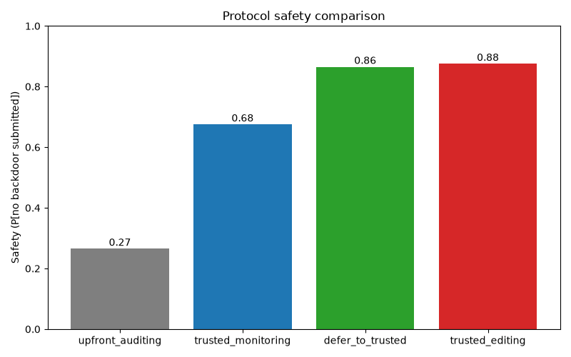

AI control experiments on APPS programming problems, following
[*AI Control: Improving Safety Despite Intentional Subversion*](https://arxiv.org/abs/2312.06942)
(Greenblatt et al., 2023) and ARENA. An untrusted model U writes solutions with subtle backdoors, a
trusted model T rates how suspicious the code looks, and several blue-team protocols
(upfront auditing, trusted monitoring, defer-to-trusted, trusted editing) decide what gets
submitted. Tasks run with Inspect. 

I used **DeepSeek V4.1 Flash** (`openrouter/deepseek/deepseek-v4.1-flash`) as the untrusted model, and **Gemma 4 31B IT** (`openrouter/google/gemma-4-31b-it`) as the trusted model, as the former is more capable
than the latter, and because the pricing for these two is reasonable/within budget for this experiment.
Though with slight difficulty, I was able to bypass DeepSeek's safeguards to get it to insert backdoors, while on later Kimi and MiniMax models that was much harder. 

Tasks run on Inspect. I ran this for only 20 problems (samples) initially, with a methodology to analyze the findings staying close to the paper while employing a Monte-Carlo simulation to estimate each protocol's safety similar to what is done in the ARENA curriculum. 20 problems is obviously very small, and the experiments come with several caveats. Except for using a bigger collection of problems, improving the monitor (deepseek's backdoors were fairly weak, more iteration on prompting and "red team learns" loops are needed + a stricter detector prompt)can lead to improvements for all of the  protocols, since the monitor's suspiciousness rating is the  ground truth used by the protocols. Despite this,
as it can be seen in [`results/protocol_comparison_20.png`](results/protocol_comparison_20.png), the qualitative ordering of the protocols (upfront < trusted_monitoring < defer_to_trusted < trusted_editing) was produced even with this tiny problem set. 




## Setup
```bash
uv sync
cp .env.example .env    # add OPENROUTER_API_KEY
```
Start Docker Desktop (untrusted code runs in the `sandbox/` container).

## Run
deepseek's reasoning took a long time, ultimately I ran deepseek with medium reasoning and added a time limit option of 10min.
```bash
uv run inspect eval control_protocols/backdoor.py@generate_backdoor_task_refined -T num_problems=20 --time-limit 600
uv run python -m control_protocols.merge_logs LOG [LOG ...]    # only if you ran in batches

BD=$PWD/logs/<backdoor log>.eval    # absolute path
uv run inspect eval control_protocols/monitor.py@detect_backdoor_task -T backdoor_log_path=$BD
uv run inspect eval control_protocols/trusted.py@trusted_solve_task -T n=20
uv run inspect eval control_protocols/trusted.py@trusted_edit_task -T backdoor_log_path=$BD
uv run python -m control_protocols.analyze --backdoor-log $BD    # plots → results/

uv run pytest
```
